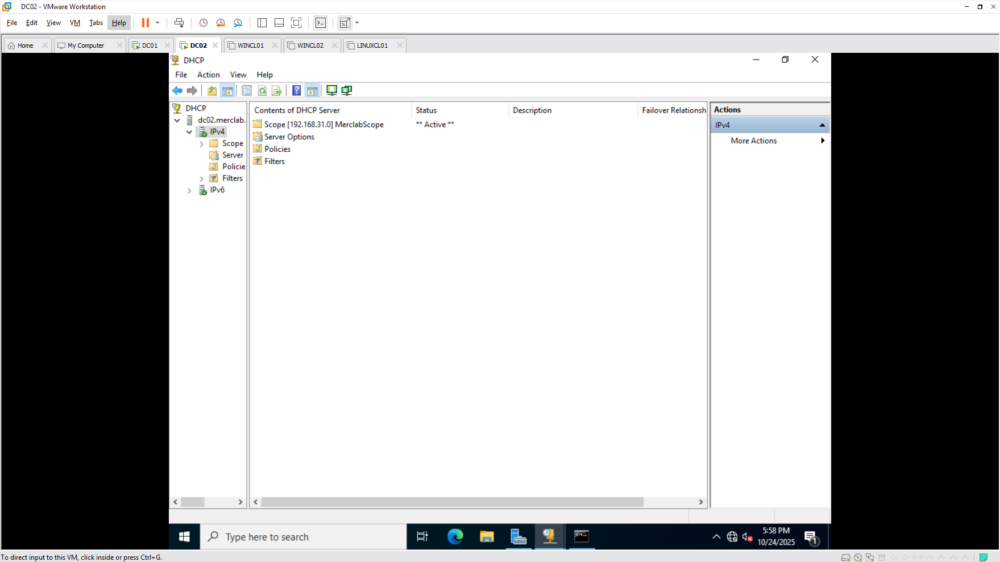

# Windows & Linux Virtual Lab Environment – VMware Workstation Pro

This project is a small enterprise-style virtual lab I built using VMware Workstation Pro.  
It simulates a Windows domain network with two servers, two clients, and a Linux system used for file sharing.  
The goal was to get hands-on experience with Active Directory, DHCP, DNS, GPOs, and Samba in a safe virtual setup.

---

## Network Configuration

All virtual machines are on a private VMware network (VMnet) using the 192.168.31.0/24 subnet.  
Static IPs were assigned for the servers, and DHCP was configured for clients.

| Hostname  | Role                         | IP Address     |
|------------|------------------------------|----------------|
| DC01       | Active Directory, DNS        | 192.168.31.130 |
| DC02       | DHCP (Authorized)            | 192.168.31.132 |
| LINUXCL01  | Samba File Server            | 192.168.31.134 |
| WINCL01    | Windows Client (Standard)    | 192.168.31.133 |
| WINCL02    | Windows Client (IT Support)  | 192.168.31.132 |

**Setup Highlights:**
- Created and configured a private virtual network.
- Installed and promoted DC01 as a domain controller.
- Installed and authorized DHCP on DC02.
- Joined both Windows clients and the Linux system to the network.
- Set up file shares, permissions, and a DoD style logon banner through Group Policy.
- Verified connectivity with ping tests and access checks.

---

## Network Topology

---

## Verification Screenshots

### DC01 – Active Directory, GPO, and File Sharing

---

### DC02 – DHCP and Domain Join

---

### LINUXCL01 – Samba Server

---

### WINCL02 – IT Support Client

---

## Notes

This lab helped me understand how Windows servers, Linux systems, and domain clients interact in a real environment.I set up every component from scratch from official ISOs, no prebuilt images or templates. The goal was to build an enterprise domain environment on a small scale.

---

### Tools Used
- VMware Workstation Pro  
- Windows Server 2019  
- Windows 10 Pro  
- Ubuntu 22.04 LTS  
- Active Directory, DHCP, DNS, Group Policy, and Samba
- TCP/IP Networking and Configuration

---

### Skills Demonstrated
- Setting up and managing Windows and Linux systems in a virtual lab
- Configuring and troubleshooting Active Directory, DHCP, and DNS
- Creating and applying Group Policies (GPOs) for user and system management
- Managing file shares and permissions across Windows and Linux (Samba)
- Building and documenting a functioning network topology from scratch
- Understanding TCP/IP basics, subnetting, and address management
- Using PowerShell, Windows utilities, and terminal commands for configuration and testing
- Writing clear documentation and organizing technical evidence for review

### Author
**Carlos Mercedes**  
[GitHub](https://github.com/CarlosAMercedes)  
[LinkedIn](https://linkedin.com/in/carlosmercedes98)
